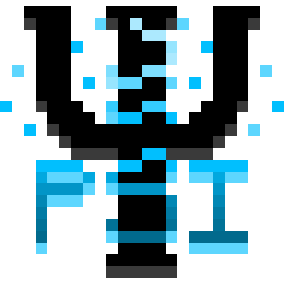

 

  

<h1>
I build software focused on automation, performance, and practical solutions.
</h1>

<h3>
Brazilian software engineer, fluent in English, with 10+ years of experience across backend, frontend,
databases, machine learning, and AI agents.
</h3>

---

## About me

My name is **Ícaro Manoel de Lima Santana**.

I have been building software for over **10 years**, and what keeps me interested in this field is the same thing that got me into it in the first place: the idea that systems can be improved, optimized, and made smarter.

I enjoy working across the full development process, from backend structure and business logic to frontend implementation and tooling. What I usually care about most is building things that are actually useful, reliable, and efficient in the real world.

A big part of the way I think about software comes from my obsession with automation.  
I genuinely enjoy looking at a repetitive task and asking:

> how can this be faster, cleaner, and require less manual effort?

That mindset is one of the reasons I became so interested in **machine learning** and **AI agents**. I like systems that can adapt, assist, and remove friction.

---

## Where my interest in automation started

Oddly enough, a lot of my love for automation came from playing **modded Minecraft**.

Mods like **Mekanism**, **Psi**, and **Create** made me obsessed with the idea of building processes, connecting systems, reducing manual work, and turning messy workflows into something elegant and efficient.

That same mindset naturally carried over into software engineering.

  

<table>
  <tr>
    <td align="center">
       
      <strong>Mekanism</strong>
    </td>
    <td align="center">
       
      <strong>Psi</strong>
    </td>
    <td align="center">
       
      <strong>Create</strong>
    </td>
  </tr>
</table>

---

## Main stack

### Languages

  

### Databases / Backend services

  

### Tools / IDEs

  

### Also work with

---

## What I like building

- web applications
- backend services
- internal tools
- dashboards
- automation pipelines
- AI-powered systems
- developer tooling
- practical products that remove repetitive work

---

## What I care about in software

I like software that feels intentional.

Not just code that works, but code that is maintainable, readable, scalable, and built with a clear purpose behind it.

A few things I naturally pay attention to:

- reducing unnecessary complexity
- improving workflow efficiency
- writing maintainable systems
- designing clean developer experiences
- building tools that save time
- turning manual processes into automated ones

---

## Current interests

Right now, the areas that interest me the most are:

- **automation**
- **machine learning**
- **AI agents**
- **system design**
- **developer productivity**
- **smart tooling**

These are the kinds of things I like exploring, building, and improving over time.

---

## A bit of how I think

I tend to approach development with a very straightforward mindset:

If something is repetitive, it should probably be automated.  
If something is slow, it should probably be optimized.  
If something is confusing, it should probably be redesigned.  
If something can be simpler, it usually should be.

---

## GitHub

